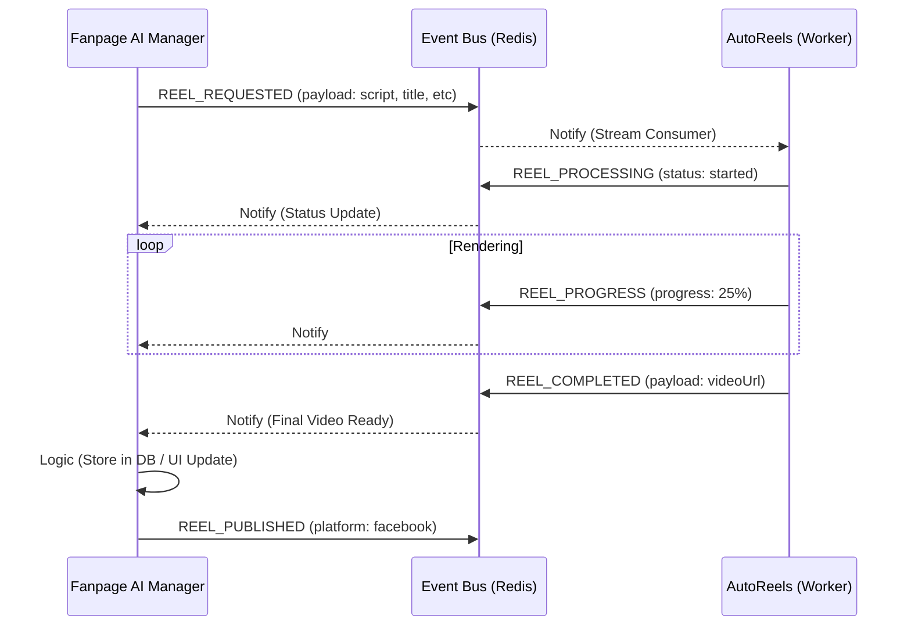

# Communication Design: fanpage-ai-manager <-> autoreels

This document outlines the event-driven communication flow between the **Fanpage AI Manager** and **AutoReels** using the **Event Bus Service** (Redis-based).

## Architecture Overview

The system uses an event-driven architecture where services communicate asynchronously via a central Redis Stream.



- **Event Bus Service**: The central hub that manages Redis Streams and broadcasts events.
- **Fanpage AI Manager**: The "Orchestrator" that manages content, schedules, and triggers generation.
- **AutoReels**: The "Worker" that performs the heavy lifting of video generation (rendering, FFmpeg, etc.).

---

## Event Stream: `reels_stream`

All communication regarding reel lifecycle should happen on the `reels_stream`.

### 1. The Generation Request
When a user or a scheduled task triggers a new video generation.

**Event:** `REEL_REQUESTED`
**Source:** `fanpage-ai-manager`
**Payload:**
```json
{
  "reelId": "uuid-123",
  "title": "Top 5 AI Tools",
  "script": "...",
  "voiceId": "alloy",
  "musicId": "bg-lofi-01",
  "metadata": {
    "sourceArticleId": "art-456",
    "targetPage": "AI Daily"
  }
}
```

### 2. Acknowledgment & Processing
AutoReels picks up the task.

**Event:** `REEL_PROCESSING`
**Source:** `autoreels`
**Payload:**
```json
{
  "reelId": "uuid-123",
  "status": "started",
  "workerId": "worker-node-01"
}
```

**Event:** `REEL_PROGRESS` (Optional/Periodic)
**Source:** `autoreels`
**Payload:**
```json
{
  "reelId": "uuid-123",
  "progress": 45,
  "stage": "rendering_scenes"
}
```

### 3. Completion / Failure
AutoReels finishes the job.

**Event:** `REEL_COMPLETED`
**Source:** `autoreels`
**Payload:**
```json
{
  "reelId": "uuid-123",
  "videoUrl": "https://storage.com/vids/123.mp4",
  "thumbnailUrl": "https://storage.com/vids/123.jpg",
  "duration": 58.5
}
```

**Event:** `REEL_FAILED`
**Source:** `autoreels`
**Payload:**
```json
{
  "reelId": "uuid-123",
  "error": "Out of memory during FFmpeg render",
  "retriable": true
}
```

### 4. Distribution (Publishing)
Fanpage Manager receives the completion and proceeds to publish.

**Event:** `REEL_PUBLISHED`
**Source:** `fanpage-ai-manager`
**Payload:**
```json
{
  "reelId": "uuid-123",
  "platform": "facebook",
  "postId": "fb_reel_999",
  "status": "live"
}
```

---

## Implementation Checklist

### [ ] Event Bus Service
- [ ] Ensure Redis Streams are properly initialized.
- [ ] Implement consumer groups for `autoreels` to handle scaling (multiple workers).

### [ ] Fanpage AI Manager
- [ ] Add `EventBusClient` to publish `REEL_REQUESTED`.
- [ ] Create a listener for `REEL_COMPLETED` and `REEL_FAILED`.
- [ ] Update UI to reflect real-time status from the bus.

### [ ] AutoReels
- [ ] Add `EventBusClient` to listen for `REEL_REQUESTED`.
- [ ] Publish status updates (`PROCESSING`, `PROGRESS`, `COMPLETED`).
- [ ] Ensure idempotency (don't process the same `reelId` twice).

---

## Benefits of this Design
1. **Decoupling**: `fanpage-ai-manager` doesn't need to know where `autoreels` is running or how many workers there are.
2. **Reliability**: If `autoreels` is down, requests stay in the Redis Stream until it comes back up.
3. **Observability**: The monitoring UI of `event-bus-service` can show the entire lifecycle of a reel in real-time.
