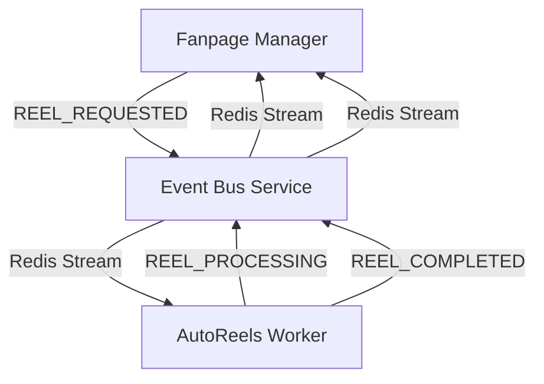

# Tài liệu Hệ thống Event Bus & Báo cáo Sửa lỗi

Tài liệu này tóm tắt các thay đổi gần đây và kiến trúc hiện tại của hệ thống giao tiếp hướng sự kiện (event-driven) giữa **Fanpage AI Manager**, **AutoReels**, và **Event Bus Service**.

## 1. Các vấn đề đã giải quyết

### A. Xung đột Cổng (Port) & Tài nguyên
- **Vấn đề**: Cổng `3000` (Express) và `24678` (Vite HMR) đã bị chiếm dụng, khiến server dev không thể khởi động.
- **Giải pháp**: 
    - Đã dừng các tiến trình `node.exe` đang chạy ngầm.
    - Cập nhật `autoreels` sử dụng cổng HMR riêng (**24679**) để tránh xung đột với manager khi chạy đồng thời trên máy cục bộ.

### B. Lỗi "Reel undefined" & Double Stringification
- **Vấn đề**: Log hiển thị `Reel undefined is being processed...`. Nguyên nhân do `event-bus-service` đã chuyển payload thành chuỗi (string) trước khi đưa vào object message, sau đó lại chuyển cả message thành chuỗi một lần nữa khi lưu vào Redis.
- **Giải pháp**: Loại bỏ việc `JSON.stringify(payload)` dư thừa trong `event-bus-service/src/redis.ts`. Hiện tại payload được giữ nguyên dạng object và chỉ được chuyển thành chuỗi một lần duy nhất ở cấp độ message.

### C. Sai lệch Ánh xạ Dữ liệu (Payload Mapping)
- **Vấn đề**: Sự kiện `REEL_REQUESTED` bị thiếu các trường quan trọng như `articleId` và `templateId`, đồng thời định dạng `script` không khớp với mong đợi của AutoReels.
- **Giải pháp**: 
    - Khôi phục đầy đủ ánh xạ payload trong `fanpage-ai-manager/backend/services/autoreels.service.ts`.
    - Cập nhật `autoreels/server/services/eventBusWorker.ts` để trích xuất và lưu chính xác các trường này vào database `VideoTask`.

---

## 2. Kiến trúc Hệ thống

Hệ thống sử dụng **Redis Streams** làm trình môi giới tin nhắn (message broker).



### Luồng Sự kiện:
1. **Manager**: Tạo UUID (`reelId`) và gửi `REEL_REQUESTED` qua `EventBusClient`.
2. **Event Bus**: Thêm sự kiện vào `reels_stream` trong Redis.
3. **AutoReels**:
    - `eventBusWorker` nhận `REEL_REQUESTED`.
    - Tạo một `VideoTask` trong DB cục bộ.
    - `videoWorker` bắt đầu xử lý và gửi sự kiện `REEL_PROCESSING`.
    - Sau khi hoàn thành, gửi `REEL_COMPLETED` (kèm theo `videoUrl`).
4. **Manager**:
    - `eventBusWorker` nhận `REEL_PROCESSING` (cập nhật trạng thái hàng chờ).
    - Nhận `REEL_COMPLETED` (cập nhật bài viết với `videoUrl`, xóa khỏi hàng chờ, và kích hoạt đăng bài ngay nếu đã quá giờ lên lịch).

---

## 3. Cấu hình Cổng (Port) Phát triển Cục bộ

| Dịch vụ | Cổng (Port) | Cổng HMR (Vite) |
| :--- | :--- | :--- |
| **Fanpage AI Manager** | `3000` | `24678` (Mặc định) |
| **AutoReels** | `3003` | `24679` (Tùy chỉnh) |
| **Event Bus Service** | `4004` | N/A |

---

## 4. Cấu trúc Payload

### REEL_REQUESTED
```json
{
  "reelId": "chuỗi-uuid",
  "articleId": "id-bài-viết",
  "title": "Tiêu đề Video",
  "templateId": "classic/modern",
  "content": "Nội dung văn bản thô",
  "script": "Chuỗi JSON của { scenes: [...] }",
  "imageUrl": "url-hình-ảnh-gốc",
  "ttsProvider": "edge/ohfree",
  "ttsVoiceId": "id-giọng-đọc",
  "source": "manager"
}
```

### REEL_COMPLETED
```json
{
  "reelId": "chuỗi-uuid",
  "videoUrl": "https://url-cloudinary.mp4",
  "thumbnailUrl": "https://url-cloudinary.jpg"
}
```

---

## 5. Lệnh Bảo trì

Nếu các cổng bị chiếm dụng trở lại, hãy sử dụng các lệnh sau để giải phóng:

```powershell
# Tìm và dừng tiến trình trên cổng cụ thể
netstat -ano | findstr :3000
taskkill /F /PID <PID_TÌM_THẤY>

# Hoặc dừng tất cả tiến trình node (Reset nhanh)
taskkill /F /IM node.exe
```
